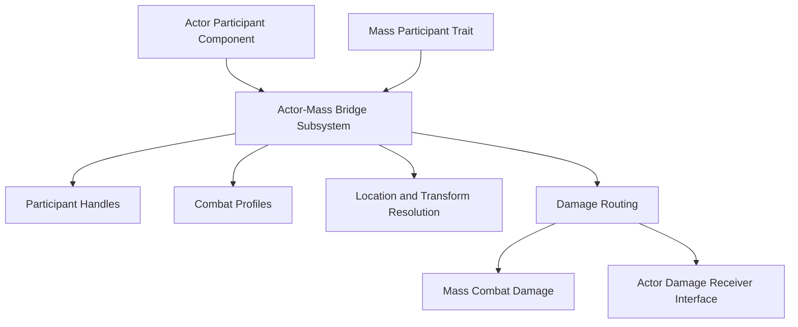

# Actor-Mass Bridge

The Actor-Mass Bridge is for projects that need both worlds: detailed Unreal Actors where they matter, and Mass entities where scale matters. It lets regular Unreal Actors and Mass entities participate in the same combat simulation.

The Top Down Zombie Shooter sample uses this pattern: player operatives are Actor characters, while zombies are Mass entities. The bridge gives both sides combat handles, team attitudes, eligibility checks, location resolution, and damage routing.

The bridge exists so you do not have to choose one representation for everything. Mass can carry the crowd, while Actors can carry the handful of units that need Character Movement, rich components, Animation Blueprints, inventory, or direct player control.

## When To Use It

Use the Actor-Mass Bridge for:

- hero units
- squad members
- bosses
- objectives
- vehicles
- interactable combat props
- Actor-based player characters
- Mass enemy waves that need to damage Actors

Keep high-count units in Mass whenever possible. Use Actors for entities that need rich components, Character movement, animation blueprints, inventory, bespoke interaction, or detailed Blueprint logic.

## Key Concepts

- **Participant** - an Actor or Mass entity registered with the bridge.
- **Participant handle** - a stable reference used by bridge queries and damage routing.
- **Combat profile** - affiliation and eligibility flags for combat.
- **Affiliation** - broad identity such as Operative or Enemy.
- **Attitude** - friendly, neutral, or hostile relationship between participants.
- **Damage receiver** - Actor interface for receiving bridge-routed damage.
- **Eligibility checks** decide whether a participant can initiate combat, receive combat, and be targeted.

## Architecture

## Actor Setup

For an Actor to participate:

1. Add the Actor-Mass Bridge Participant Component.
2. Enable auto registration or register manually.
3. Configure its combat profile.
4. If the Actor can receive damage, implement the bridge damage receiver interface.

Combat profile flags decide whether the Actor can initiate combat, receive combat, and be targeted.

Actors that receive bridge damage should implement the damage receiver interface. That keeps the bridge from owning your Actor health model; it simply routes the damage request to the Actor-side system that knows how to apply it.

## Mass Entity Setup

For a Mass entity to participate, add the Actor-Mass Bridge participant trait to its Entity Config Asset or use the sample enemy configs. The bridge can then resolve that Mass entity through the same participant-handle flow used for Actors.

## Damage Routing

The bridge routes damage based on source and target domain:

- Actor to Actor
- Actor to Mass
- Mass to Actor
- Mass to Mass

Mass targets use the combat damage path. Actor targets receive damage through the bridge damage receiver interface, allowing your Actor-side health component or gameplay component to decide how to apply the result.

:::note
The bridge does not replace the Combat System. It connects Actors to the Combat System where domains meet.
:::

## Configuration

Combat profiles include:

- affiliation
- can initiate combat
- can receive combat
- targetable

Use affiliation to establish broad hostility rules. In the included sample, Operative and Enemy participants are hostile to each other.

The profile also includes flags for whether the participant can initiate combat, receive combat, and be targeted. This is useful for objectives, neutral props, temporary invulnerability, or support Actors that should appear in queries but not fight.

## Performance Considerations

The bridge is meant for mixed simulations, not for converting every Mass unit into Actor-style behavior. Keep the number of Actor participants reasonable, and use Mass for the high-count side of the simulation.

For spatial queries, use practical radii and result limits. Actor-heavy bridge queries can become more expensive than pure Mass combat.

## Troubleshooting

### Actor is ignored by Mass enemies

- Confirm the Actor has a bridge participant component.
- Confirm it registered successfully.
- Confirm its combat profile is targetable and can receive combat.
- Confirm affiliation makes it hostile to the Mass enemy.

### Actor does not take damage

- Confirm the Actor implements the bridge damage receiver interface.
- Confirm `IsBridgeCombatAlive` returns true.
- Confirm the damage request is not rejected as invalid or ineligible.

### Mass unit cannot be resolved

- Confirm the Mass entity is alive.
- Confirm it has the bridge participant trait or has been registered manually.
- Confirm the handle is current and not stale.

## Related Docs

- [Combat System](./combat-system.md)
- [Top Down Zombie Shooter Sample](../getting-started/sample-game-modes.md)
- [Creating Units](../guides/creating-units.md)
