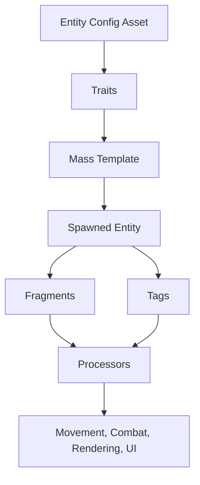

# Entity System

The Entity System is the foundation that makes Pioneer units reusable instead of one-off. It uses Entity Config Assets and traits to describe what each unit can do, then builds Mass templates that can be spawned efficiently at runtime.

This composition-based workflow lets you create different unit types without writing custom code for every variation. A swordsman, archer, catapult, worker, zombie, or custom unit can share the same core systems while using different trait settings.

Instead of building a separate Actor class for every unit, Pioneer treats units as data. Traits add the fragments, tags, shared configuration, and initialization data needed by each system. That keeps unit authoring approachable in the editor while still giving the runtime a data-oriented structure that scales to large armies.

## Key Concepts

- **Entity** - a Mass unit in the simulation.
- **Entity Config Asset** - the authored data asset that defines a unit type.
- **Trait** - a reusable capability added to a unit config, such as movement, selection, combat, rendering, or animation.
- **Fragment** - runtime data stored on an entity and read by Mass processors.
- **Tag** - a lightweight marker used for filtering behavior.
- **Shared Fragment** - configuration shared by many entities of the same kind, such as subsystem references or per-type settings.
- **Template** - the built Mass archetype created from a config and its traits, cached so the same unit type does not need to be rebuilt every spawn.

## Architecture



## Common Traits

Pioneer includes traits for the major unit capabilities:

- **Instanced Actor Trait** - renders the entity through instanced static meshes.
- **Movement Trait** - enables navmesh movement, steering, ground Z tracking, and orientation.
- **Avoidance Trait** - adds moving avoidance, standing avoidance, hard separation, and overlap clamp settings.
- **Selectable Trait** - lets the selection system include the entity and show selection presentation.
- **LOD Trait** - reduces work for distant or low-priority units.
- **Unit Attributes Trait** - adds health, armor, attack damage, attack range, and melee timing.
- **Ranged Attack Trait** - adds projectile, line-of-sight, and ranged engagement behavior.
- **Unit Animation Trait** - connects semantic animation states to a Unit Animation Set Asset.
- **Actor-Mass Bridge Participant Trait** - lets a Mass entity interact with bridged Actors.
- **Navigation Obstacle Trait** - lets an entity contribute obstacle behavior where needed.

:::tip
Start from included configs in `Pioneer/Units` or `TopDownZombieShooter/Zombies`, then duplicate and tune. That keeps required trait combinations intact while you learn the system.
:::

## Entity Config Assets

The recommended workflow is:

1. Create or duplicate an Entity Config Asset.
2. Add the traits the unit needs.
3. Configure trait properties.
4. Use the config in a spawner, sample map, or custom spawning flow.

Entity configs can use inheritance. Put shared setup in a parent config, then make child configs for variations such as faster units, ranged units, elite units, or different visual skins.

Child configs override parent traits by class. This is useful for unit families: a base soldier config can define movement, rendering, selection, LOD, and common metadata, while child configs override only the combat stats, mesh, animation set, or ranged behavior that makes each unit different.

## How Traits Build Units

Each trait contributes a focused piece of the final Mass template. For example:

- Instanced Actor Trait adds render data, mesh settings, radius, and the instancing subsystem connection.
- Movement Trait adds velocity, force, movement parameters, path following, steering, ground Z, and orientation data.
- Avoidance Trait adds the moving, standing, hard separation, and clamp settings used by the navigation processors.
- Selectable Trait adds selection state and the mesh used for selection presentation.
- Unit Attributes Trait adds health, armor, team-aware combat stats, and attack timing.
- Unit Animation Trait connects the unit to a resolved animation set and initial animation state.

When a unit spawns, Pioneer does not ask every system what to do with it manually. The entity's fragments and tags determine which processors include it. This is the main advantage of the trait workflow: adding a capability to a unit is mostly an authoring decision, not a custom gameplay branch.

## Trait Composition Examples

### Basic Moving Unit

```text
- Instanced Actor Trait
- Movement Trait
- Avoidance Trait
- Selectable Trait
- LOD Trait
```

### Melee Combat Unit

```text
- Instanced Actor Trait
- Movement Trait
- Avoidance Trait
- Selectable Trait
- LOD Trait
- Unit Attributes Trait
- Unit Animation Trait
```

### Ranged Combat Unit

```text
- Instanced Actor Trait
- Movement Trait
- Avoidance Trait
- Selectable Trait
- LOD Trait
- Unit Attributes Trait
- Ranged Attack Trait
- Unit Animation Trait
```

### Actor-Mass Bridge Enemy

```text
- Instanced Actor Trait
- Movement Trait
- Avoidance Trait
- LOD Trait
- Unit Attributes Trait
- Unit Animation Trait
- Actor-Mass Bridge Participant Trait
- Game-specific enemy behavior trait
```

## Runtime Lifecycle

When a unit is spawned:

1. Pioneer resolves the Entity Config Asset.
2. The config and parent configs provide their traits.
3. Traits build a Mass template.
4. The spawning system creates entities from that template.
5. Spawn initializers apply per-entity data such as transform, initial movement state, and team overrides.
6. Rendering, navigation, selection, combat, animation, and bridge systems process the entity based on its fragments and tags.
7. When the entity dies or is removed, systems clean up runtime state and hide or recycle rendering instances as needed.

## Extending Entities

To create a new gameplay capability, add a focused trait that contributes the fragments and tags your processors need. Keep the trait narrow: if it represents ranged combat, it should not also configure selection UI or camera behavior.

Good custom trait examples:

- a resource gatherer trait for workers
- a morale trait for squads
- a capture point trait for units that can claim objectives
- a special ability trait for units that need ability cooldowns

After the trait adds data to the template, your Mass processor can query entities with that data and run the behavior in batches.

## Configuration

Most users configure entities through the editor:

- movement speed and steering values
- mesh, radius, and rendering metadata
- selection presentation
- LOD thresholds
- health, armor, and attack stats
- ranged projectile settings
- animation sets
- bridge combat profiles

Use C++ when adding a new kind of gameplay capability that needs custom fragments, tags, or processors.

## Performance Considerations

- Keep traits focused and avoid adding capabilities a unit does not need.
- Use shared data for per-unit-type configuration.
- Use LOD on units that appear in large numbers.
- Prefer Mass entities for high-count units and Actors for low-count special objects.
- Use inheritance to keep unit families consistent.

## Troubleshooting

### Entity does not spawn

- Confirm the Entity Config Asset is assigned to the spawner.
- Check logs for template validation errors.
- Confirm parent configs and referenced assets load correctly.

### Entity is missing behavior

- Confirm the required trait is present.
- Confirm related systems are available in the map or game mode.
- Compare against an included working unit config.

### Combat behavior is missing

- Add Unit Attributes Trait.
- Add Ranged Attack Trait for ranged units.
- Confirm team setup and hostility rules.

### Animation behavior is missing

- Add Unit Animation Trait.
- Confirm the animation set includes all required states.
- Confirm the unit also has Instanced Actor Trait.

## Related Docs

- [Creating Units](../guides/creating-units.md)
- [Combat System](./combat-system.md)
- [Rendering System](./rendering-system.md)
- [Mass Animation System](./mass-animation-system.md)
