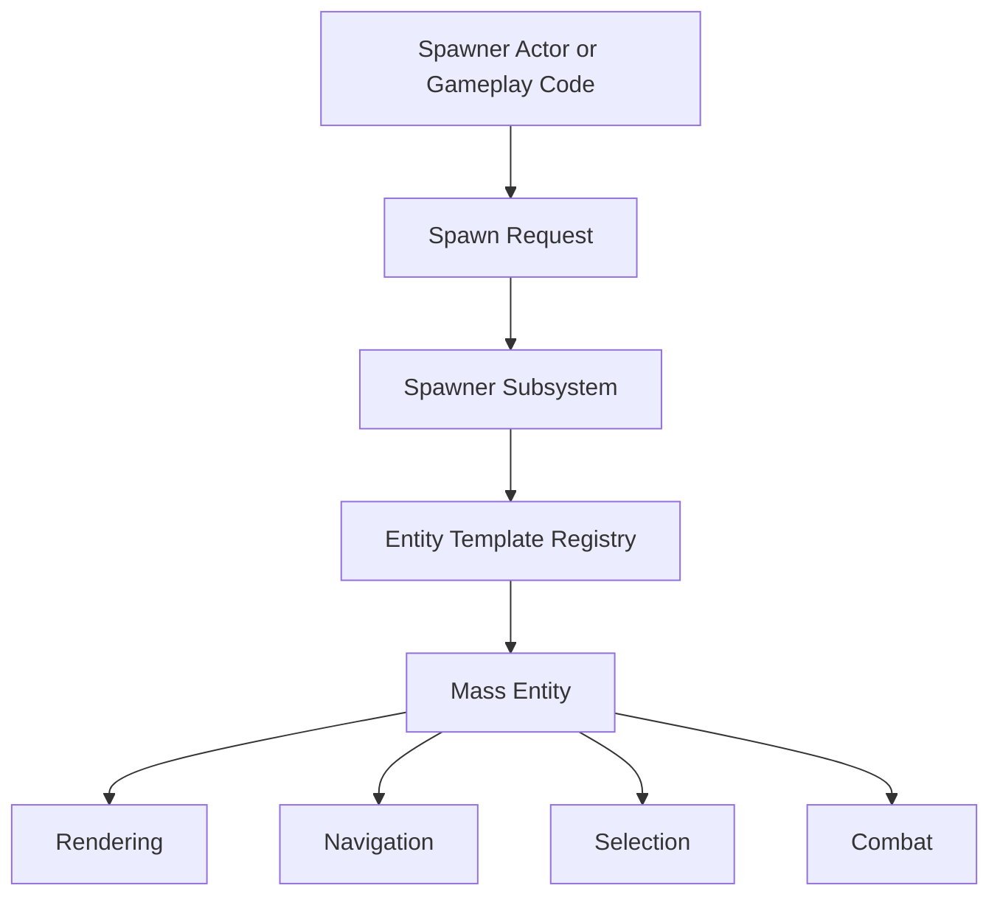

# Spawning System

The Spawning System turns authored unit configs into live Mass entities while spreading work across frames when needed. This lets you create starting armies, reinforcements, produced units, scripted encounters, or enemy waves without forcing all spawn cost into one heavy frame.

In Pioneer, spawning is more than "create N entities." It resolves the unit's Entity Config Asset, reuses the cached Mass template for that unit type, applies spawn transforms and team overrides, and then lets the rest of the systems pick the unit up through its traits and fragments.

## Key Concepts

- **Entity Config Asset** defines what kind of unit will spawn.
- **Spawn transform** defines where and how each unit appears.
- **Spawn request** queues work for the spawning system.
- **Time slicing** spreads large spawn batches over multiple frames.
- **Template caching** avoids rebuilding the same unit type repeatedly.
- **Spawner actors** provide map-friendly ways to place and configure spawn behavior.
- **Spawn initializers** apply per-entity setup such as transform, movement defaults, and combat team.
- **Team override** lets a spawner decide which side spawned units belong to without creating duplicate configs.

## Architecture

## Usage

For map-authored spawning, place a **Unit Spawner** actor or duplicate a sample setup. Assign an Entity Config Asset, choose the team, spawn count, formation type, and preview settings, then place the actor where units should appear.

For gameplay-driven spawning, issue spawn requests through the spawning system with a unit config and an array of transforms. The system handles template lookup and entity creation.

The RTS Mass Battle sample uses spawning for battle setup. The Top Down Zombie Shooter sample uses runtime spawning for enemy waves and spread-out horde pressure.

## Unit Spawner Actor

The Unit Spawner actor is the easiest way to author starting armies or placed encounters. It supports:

- team ID
- entity config selection
- spawn count
- built-in formation type or custom formation ID
- optional grouped spawning
- formation spacing multiplier
- spawn on Begin Play
- editor formation preview
- hiding the preview after spawn

Use this for RTS starting forces, placed enemy packs, reinforcements, or test maps where designers need to see the spawn shape before pressing Play.

## Runtime Spawning

For game systems that spawn units dynamically, Pioneer exposes Blueprint and C++ paths for spawning a configured entity type at a list of transforms. Runtime spawning is useful for:

- wave-based enemies
- reinforcements
- summoned units
- unit production buildings
- scripted encounters
- benchmark scenarios

Large spawn jobs can be chunked. Immediate spawning is useful for small or timing-critical batches, while queued jobs are better for large armies and waves.

## Spawn Flow

When a spawn request runs:

1. The spawner resolves the Entity Config Asset.
2. The template registry creates or reuses the Mass template for that config.
3. The spawn request provides one or more transforms.
4. The spawning system creates entities in chunks or immediately.
5. Spawn initializers apply transform and starting state.
6. Optional team override applies combat team data.
7. Rendering, navigation, selection, combat, animation, and group systems process the entities based on their traits.

## Configuration

Typical spawn settings include:

- unit entity config
- team ID
- initial spawn rate or spawn count
- spawn transforms
- formation type
- custom formation ID
- grouped spawning
- formation spacing
- continuous spawning enabled or disabled
- ramp timing and maximum spawn rate

Not every spawner uses every setting. The Unit Spawner actor focuses on placed formation-based batches, while sample-specific spawners can add wave timing, spread radius, or roguelike run behavior.

## Performance Considerations

Use time-sliced spawning for large waves or army setup. Prefer a few batched spawn requests over many small per-frame requests from Blueprint.

For wave games:

- ramp spawn rates gradually
- cap maximum spawns per second
- reuse unit configs
- avoid expensive one-time effects on every spawned unit

For RTS games:

- spawn armies during setup or deployment where possible
- use LOD and instanced rendering for all large-count unit types
- keep initial formation spacing wide enough to avoid immediate separation spikes
- use grouped spawning when the units should start as a controllable army group

Avoid spawning high-count units as Actors unless they need Actor-specific behavior. Mass entity spawning is the intended path for armies, hordes, and repeated waves.

## Troubleshooting

### Units do not spawn

- Confirm the Entity Config Asset is assigned.
- Confirm the spawn request is being issued.
- Confirm the world has Mass and Pioneer systems initialized.
- Check whether the spawn location is valid for your gameplay.

### Spawned units do not move

- Confirm Movement Trait is present.
- Confirm navmesh covers the spawn area.
- Confirm runtime navigation is enabled if your level changes during play.

### Spawned units do not fight

- Confirm Unit Attributes Trait is present.
- Confirm team IDs are set.
- Confirm hostile units exist and are in range.

### Large spawns cause frame drops

- Use time-sliced spawning.
- Reduce spawn batch size or spawn rate.
- Use simpler unit meshes and LOD.
- Delay expensive presentation effects.

## Related Docs

- [Entity System](./entity-system.md)
- [Creating Units](../guides/creating-units.md)
- [Combat System](./combat-system.md)
- [Rendering System](./rendering-system.md)
